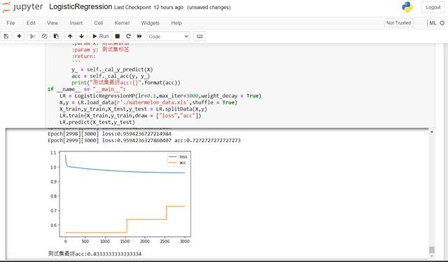
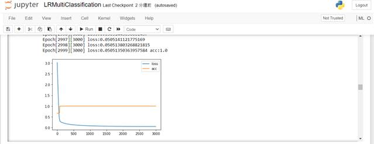
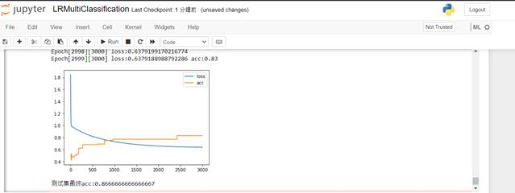

**编程实现对数几率回归算法，并将算法应用于西瓜数据集、鸢尾花数据集分类问题。**

| 数据集       | 分类数 | 数据集文件          | python代码               | 方法               |
| ------------ | ------ | ------------------- | ------------------------ | ------------------ |
| 西瓜数据集   | 二分类 | Watermelon_data.xls | LogisticRegression.py    | 常规对数几率回归   |
| 鸢尾花数据集 | 三分类 | iris.csv            | LRMultiClassification.py | 两二分类的对几回归 |

**西瓜数据集：**

总结我进行的相关的处理（上面代码都有详细注释）：

1、从xls文件类型读取数据并将数据打乱后，按照7：3的比例分为训练集和测试集

2、以0.1的学习率和一定的衰减，共运行了3000个epoch

3、在训练集上取得了72.7%的准确率并在测试集上取得了83.3%的准确率，同时绘制出了训练过程中训练集loss和acc的图像。

如下图

 

**鸢尾花数据集：**

采取方法：用两个二分类组合形成三分类：第一次分类判断是种类0和不是种类0（分类器为代码中的LR1）。第二次分类判断是种类1还是种类2（分类器为代码中的LR2）。预测时：先用LR1预测，如果是种类0，则就是种类0，否则用第二个分类器预测得到最终结果。

总结我进行的相关的处理：

1、从csv文件类型读取数据并将数据打乱后，按照7：3的比例分为训练集和测试集

2、对训练集进行处理，将它转换为上面方法提到的第一类训练集和第二类训练集，分别以0.1的学习率和一定的衰减，运行了3000个epoch。得LR1和LR2。

3、最后先用LR1预测，如果是种类0，则就是种类0，否则用第二个分类器预测得到最终结果。

下图为第一次分类图像：

 

下图为第二次分类图像

上图显示最终鸢尾花测试集的准确率有86.6%